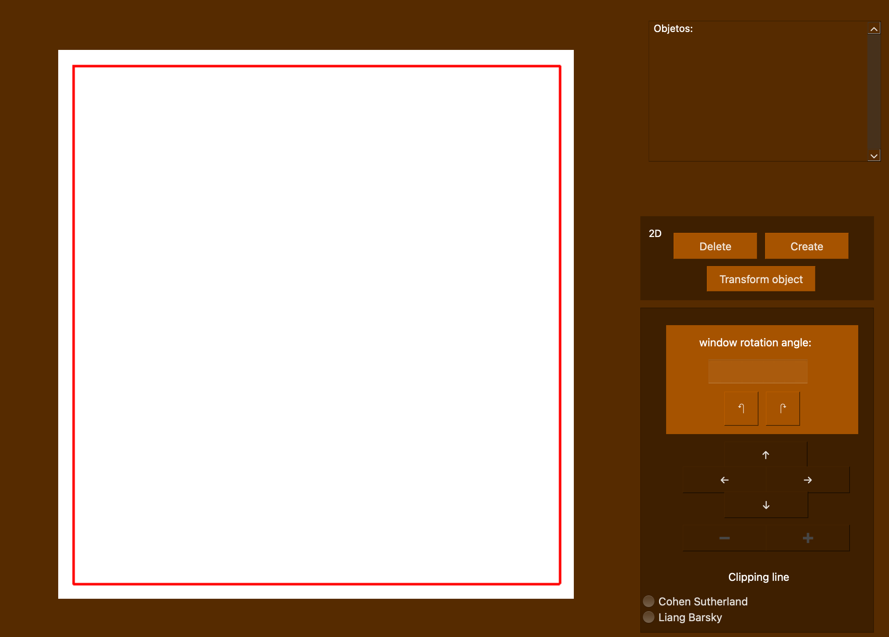
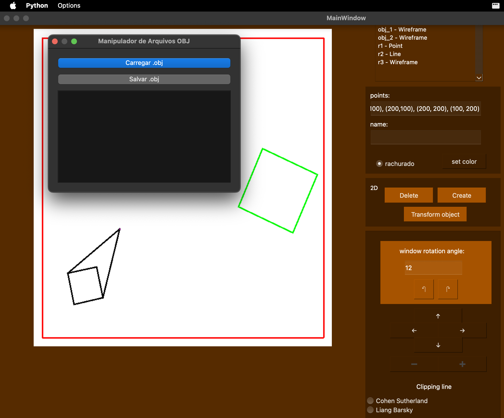

# Sistema Gráfico Interativo (SGI)

## 👨‍🎓 Alunos
- Eduardo Achar - 23102448  
- Victoria Rodrigues Veloso - 23100460  

## 🧑‍🏫 Turma
INE5420-05208 (2025.1) - Computação Gráfica  

## 📦 Instalação de Dependências 

Para a execução do código com as dependências necessárias, utilize o `requirements.txt` com:

```sh
pip install -r requirements.txt
```

## ▶️ Como Executar  

Dentro da pasta raiz do projeto, utilize o comando abaixo:

```sh
make
```

Alternativamente, é possível executar diretamente o arquivo principal do sistema (caso aplicável):

```sh
python main.py
```

## 🖼️ Interface do Sistema

### Tela Principal

Descrição: Esta é a tela inicial do sistema, onde o usuário pode selecionar as ferramentas disponíveis para criação e manipulação dos objetos do mundo, além da manipulação da visualização do mundo e escolha do algoritmo de clipping para os objetos de reta.



---

### Tela de Manipulação de Arquivos .obj

Descrição: Nesta interface, é possível importar e exportar mundos em arquivos .obj, com geração automática de seu arquivo .mtl


---

### Tela de Transformações

Descrição: Nesta interface é possível aplicar **translação**, **rotação** e **escalonamento** aos objetos gráficos criados. Transformações podem ser acumuladas antes de serem aplicadas.



---

## 🛠️ Funcionalidades Principais

### Criação de Objetos
- Ponto
- Reta
- Polígono

Exemplos de entrada:
```
Ponto: (500, 500)
Reta: (900,600),(200,600)
Polígono: (100,100), (200,100), (200, 200), (100, 200)
Bezier: (100,250), (150,100), (250, 400), (300, 250)
```

- O nome pode ser gerado automaticamente ou pelo usuário, lembrando que o sistema não suporta nomes repetidos.
- A cor pode ser escolhida automaticamente ou pelo usuário.
- Para polígonos, a flag *rachurado* define se o objeto será preenchido ou em modelo de arame.
- Não é possível editar um objeto, apenas excluir ou criar, além de selecionar no display.
- Para apagar um objeto do mundo, você deve seleciona-lo no display, assim como para aplicar transformações nele.

### Transformações Suportadas
- **Translação**: movimentação do objeto no espaço
- **Rotação**: em torno da origem, do centro do objeto ou de um ponto específico
- **Escalonamento**: alteração proporcional das dimensões do objeto

As transformações são inseridas em uma lista, podendo ser aplicadas em sequência com um único comando.

### Rotação da Window
- A window pode ser rotacionada com as setas no campo *window rotation angle*.
- Primeiro o usuário deve informar quantos graus a tela será rotacionada e depois com umas das duas setas informar a direção. 

## 🧠 Estrutura Interna dos Arquivos Fonte

```
src/
├── controller/
│   └── controller.py                  # Controlador entre modelo e visão
├── model/
│   └── display/                       
│       ├── display_file.py            # Gerencia os objetos no mundo
│       ├── display_transform.py       # Aplica transformações
│       └── display.py                 # Interface geral do display
│   └── graphic_objects/
│       ├── graphic_object.py          # Classe base
│       ├── line.py                    # Representação de retas
│       ├── point.py                   # Representação de pontos
│       └── wireframe.py               # Representação de polígonos (wireframes)
│   ├── clipping.py                    # Algoritmos de recorte
│   ├── descritor_obj.py               # Leitura e escrita de arquivos OBJ/MTL
│   ├── transform.py                   # Matrizes de transformação
│   ├── viewport.py                    # Conversão para viewport
│   └── window.py                      # Gerencia a window (janela de mundo)
├── utils/
│   ├── gui_utils.py                   # Auxiliares para interface
│   └── utils.py                       # Funções auxiliares gerais
├── view/
│   ├── main_view/
│   │   ├── gui_main.py
│   │   ├── gui_main.ui
│   │   └── main_window.py             # Interface principal
│   ├── obj_view/
│   │   └── obj_window.py              # Interface para arquivos OBJ
│   └── transform_view/
│       ├── gui_transform.py
│       ├── gui_transform.ui
│       └── transform_window.py        # Interface de transformações
├── main.py                            # Arquivo de entrada do programa
```

## 📋 Conclusão

Este projeto foi desenvolvido como parte da disciplina de Computação Gráfica com o objetivo de explorar os conceitos de geometria computacional e transformações geométricas aplicadas a objetos gráficos em 2D.

## 📚 Referências

- Angel, E., & Shreiner, D. (2011). *Interactive Computer Graphics: A Top-Down Approach with Shader-Based OpenGL*. Pearson.
- Materiais da disciplina INE5420 – Computação Gráfica, UFSC.
