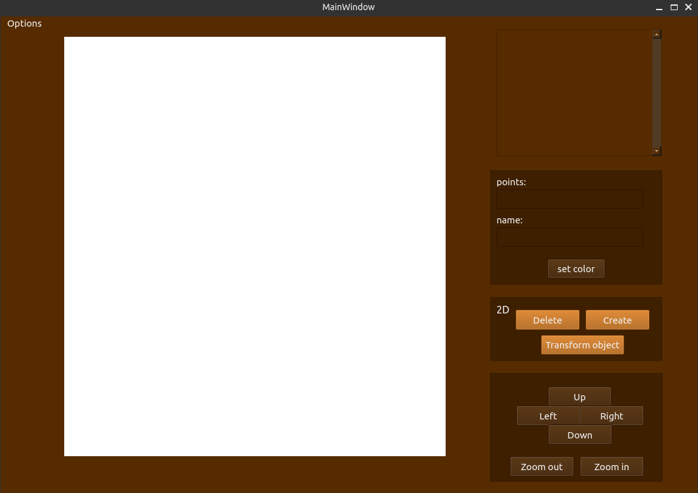
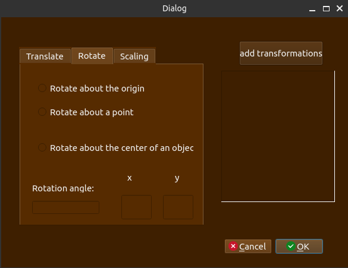
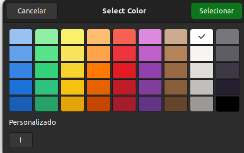

# Sistema Gráfico Interativo (SGI)

### Alunos
Eduardo Achar - 23102448
Victoria Rodrigues Veloso - 23100460

### Turma
INE5420-05208 (20251) - Computação Gráfica

## Mudanças efetuadas

Para a segunda entrega do SGI, foram realizadas pequenas melhorias na interface gráfica, conforme ilustrado na imagem abaixo. Entre as alterações, além da atualização das cores, foi adicionada uma barra de rolagem para facilitar a navegação no display.


<div style="text-align: center;">
    
    <p style="font-style: italic; font-size: 12px;"></p>
</div>


## Novas funcionalidades


<div style="text-align: center;">
    
    <p style="font-style: italic; font-size: 12px;"></p>
</div>


<div style="text-align: center;">
    
    <p style="font-style: italic; font-size: 12px;"></p>
</div>

## Instalação de dependências 

Para a execução do código com as dependêcias necessárias, um requirements.txt foi disponibilizado e pode ser instalado através do comando: 

```sh
pip install -r requirements.txt
```

## Como Executar  
Para executar o programa, dentro da pasta raiz, é possível executar o makefile com o comando abaixo:


```sh
make
```


## Exemplos de entrada


Coordenadas de exemplo para a criação de um ponto:
 ```
 (500,-500)
 ```
Coordenadas de exemplo para a criação de uma reta:


```
(900,600),(200,600) 
```

Coordenadas de exemplo para a criação de um polígono:

 ```
(100,100), (200,100), (200, 200), (100, 200)
 ```