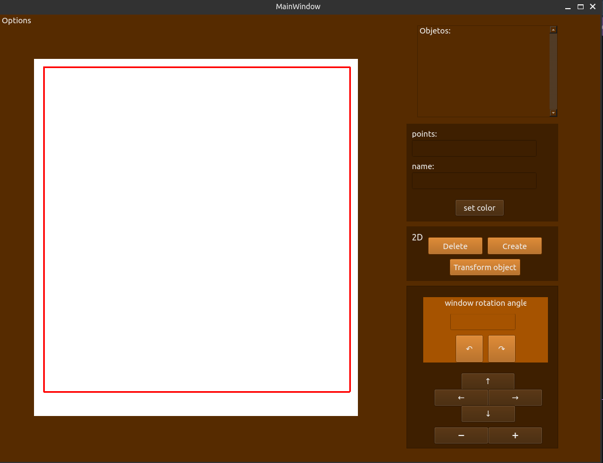
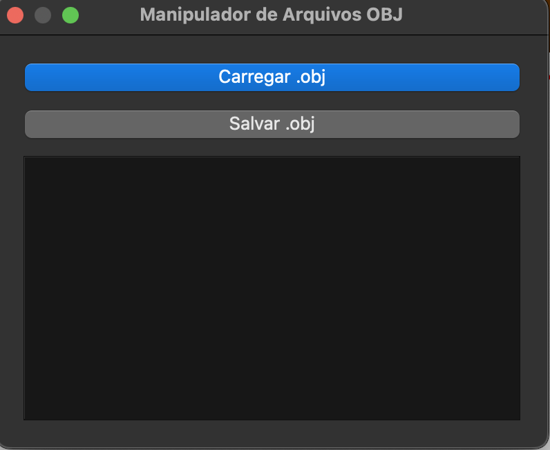

# Sistema Gráfico Interativo (SGI)

### Alunos
Eduardo Achar - 23102448
Victoria Rodrigues Veloso - 23100460

### Turma
INE5420-05208 (20251) - Computação Gráfica

## Mudanças efetuadas

Para a terceira entrega do SGI, foram implementadas duas novas funcionalidades. A rotação da window por meio do uso do sistema de coordenadas normalizadas (SCN), e um módulo de manipulação de arquivos .obj, que pode importar e exportar mundos .obj através da leitura e geração automática de arquivos .mtl para estilização


## ela principal com nova funcionalidade
<!-- TODO: Atualizar imagem da nova interface -->

<div style="text-align: center;">
    
    <p style="font-style: italic; font-size: 12px;"></p>
</div>


## Novas funcionalidades

<div style="text-align: center;">
    
    <p style="font-style: italic; font-size: 12px;"></p>
</div>


## Instalação de dependências 

Para a execução do código com as dependêcias necessárias, um requirements.txt foi disponibilizado e pode ser instalado através do comando: 

```sh
pip install -r requirements.txt
```

## Como Executar  
Para executar o programa, dentro da pasta raiz, é possível executar o makefile com o comando abaixo:


```sh
make
```


## Exemplos de entrada


Coordenadas de exemplo para a criação de um ponto:
 ```
 (500,500)
 ```
Coordenadas de exemplo para a criação de uma reta:


```
(900,600),(200,600) 
```

Coordenadas de exemplo para a criação de um polígono:

 ```
(100,100), (200,100), (200, 200), (100, 200)
 ```