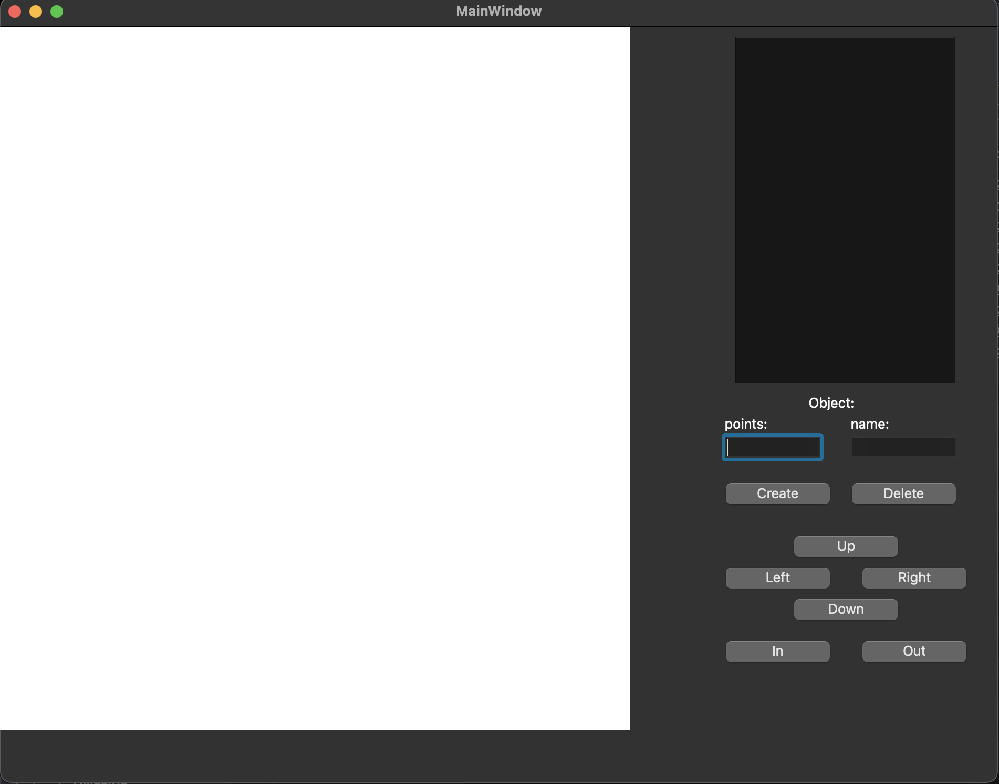

# Sistema Gráfico Interativo (SGI)

## Alunos
Eduardo Achar - 23102448
Victoria Rodrigues - 

## Turma
INE5420-05208 (20251) - Computação Gráfica
Trabalho 1.1 - Sistema básico com Window e Viewport

## Introdução 
Este projeto foi desenvolvido para a disciplina de Computação Gráfica e tem como objetivo implementar um Sistema Gráfico Interativo (SGI) que permite a criação e manipulação de objetos gráficos básicos, como pontos, retas e polígonos, utilizando conceitos de transformação de coordenadas e viewport. 

## Tela Inicial  
Abaixo está a interface inicial do sistema:  



## Como Executar  
Para iniciar o programa, navegue até a pasta `cg/src` e execute o seguinte comando no terminal:  

```sh
python3 main.py
```

## Funcionalidades  

### **Adicionar um Ponto**  
- Para adicionar um ponto, insira as coordenadas no campo **"points"**, seguindo o formato:  

  ```
  (x, y)
  ```

- O nome do ponto é opcional. Caso queira nomeá-lo, preencha o campo **"name"** antes de selecionar **"Create"**.

### **Adicionar uma Reta**  
- A reta **deve** ter um nome.  
- No campo **"name"**, insira o nome desejado.  
- No campo **"points"**, insira as coordenadas dos dois pontos que definem a reta no formato:  

  ```
  (x1, y1), (x2, y2)
  ```

- Clique em **"Create"** para adicionar a reta.

### **Adicionar um Polígono**  
- O polígono também **precisa** de um nome.  
- No campo **"name"**, insira o nome do polígono.  
- No campo **"points"**, informe as coordenadas dos vértices no formato:  

  ```
  (x1, y1), (x2, y2), (x3, y3), ..., (xn, yn)
  ```

- Após preencher os campos, selecione **"Create"**.

### **Remover uma Estrutura**  
- Para excluir um elemento, insira o **nome** no campo **"name"** e clique em **"Delete"**.

---