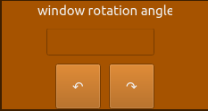

# Sistema Gráfico Interativo (SGI)

### Alunos
Eduardo Achar - 23102448
Victoria Rodrigues Veloso - 23100460

### Turma
INE5420-05208 (20251) - Computação Gráfica

## Mudanças efetuadas

Para a terceira entrega do SGI, foram implementadas duas novas funcionalidades. A rotação da window por meio do uso do sistema de coordenadas normalizadas (SCN), e um módulo de manipulação de arquivos .obj, que pode importar e exportar mundos .obj através da leitura e geração automática de arquivos .mtl para estilização.

### Rotação da window


<!-- TODO -->


### Importação e Exportação de Arquivos .obj e .mtl
Para esta funcionalidade, foi utilizado como base o arquivo de exemplo disponibilizado no Moodle. O manipulador de arquivos foi desenvolvido para reconhecer automaticamente o arquivo .mtl associado durante a importação de um .obj, além de gerar um novo .mtl correspondente durante a exportação.

Para acessar essa funcionalidade:

Clique em "Options", localizado na barra no canto superior esquerdo.
Em seguida, selecione "Object Files".
Importação:

Escolha a opção "Carregar .obj".
Um explorador de arquivos será aberto. Selecione o arquivo .obj desejado.
O sistema irá importar automaticamente o arquivo .obj e o arquivo .mtl correspondente (caso esteja no mesmo diretório), agregando ambos ao mundo atual.
Exportação:

Após acessar "Object Files", selecione a opção "Salvar .obj".
Escolha o local onde deseja salvar o arquivo.
O sistema criará um arquivo .obj com o mundo atual, e, no mesmo diretório, será gerado automaticamente um arquivo .mtl com o mesmo nome.

### Mudanças em Outras Funcionalidades

A partir desta versão, qualquer objeto pode ser inicializado com ou sem um nome ou cor definidos pelo usuário. Caso essas informações não sejam fornecidas, o sistema atribuirá automaticamente um nome e uma cor padrão.

#### Exclusão de Objetos:
Para excluir um objeto, selecione-o na lista de exibição (**display**) e clique no botão **"Delete"**.

#### Aplicação de Transformações:
Para aplicar uma sequência de transformações a um objeto:

1. Selecione o objeto desejado na lista de exibição.
2. Clique em **"Transform Object"**.
3. Na interface de transformações, preencha os campos necessários para cada transformação desejada.
4. Clique em **"Add Transformation"** para adicionar à lista.
5. Caso deseje remover uma transformação, selecione-a na lista e clique em **"Remove Transformation"**.
6. Após configurar todas as transformações, clique em **"OK"** para aplicá-las ao objeto.


## Tela principal com nova funcionalidade
<!-- TODO: Atualizar imagem da nova interface -->

<div style="text-align: center;">
    
    <p style="font-style: italic; font-size: 12px;"></p>
</div>

### Importação e Exportação de Arquivos .obj e .mtl

## Novas funcionalidades

### Importação e Exportação de Arquivos .obj e .mtl

<div style="text-align: center;">
    
    <p style="font-style: italic; font-size: 12px;"></p>
</div>


Para esta funcionalidade, foi utilizado como base o arquivo de exemplo disponibilizado no Moodle. O manipulador de arquivos foi desenvolvido para reconhecer automaticamente o arquivo .mtl associado durante a importação de um .obj, além de gerar um novo .mtl correspondente durante a exportação.

Para acessar essa funcionalidade:

Clique em "Options", localizado na barra no canto superior esquerdo.
Em seguida, selecione "Object Files".
Importação:

Escolha a opção "Carregar .obj".
Um explorador de arquivos será aberto. Selecione o arquivo .obj desejado.
O sistema irá importar automaticamente o arquivo .obj e o arquivo .mtl correspondente (caso esteja no mesmo diretório), agregando ambos ao mundo atual.
Exportação:

Após acessar "Object Files", selecione a opção "Salvar .obj".
Escolha o local onde deseja salvar o arquivo.
O sistema criará um arquivo .obj com o mundo atual, e, no mesmo diretório, será gerado automaticamente um arquivo .mtl com o mesmo nome.

### Mudanças em outras funcionalidades

A partir desta versão, qualquer objeto pode ser inicializado com ou sem um nome ou cor definidos pelo usuário. Caso essas informações não sejam fornecidas, o sistema atribuirá automaticamente um nome e uma cor padrão.

#### Exclusão de objetos:
Para excluir um objeto, selecione-o na lista de exibição (**display**) e clique no botão **"Delete"**.

#### Aplicação de transformações:
Para aplicar uma sequência de transformações a um objeto:

1. Selecione o objeto desejado na lista de exibição.
2. Clique em **"Transform Object"**.
3. Na interface de transformações, preencha os campos necessários para cada transformação desejada.
4. Clique em **"Add Transformation"** para adicionar à lista.
5. Caso deseje remover uma transformação, selecione-a na lista e clique em **"Remove Transformation"**.
6. Após configurar todas as transformações, clique em **"OK"** para aplicá-las ao objeto.


## Instalação de dependências 

Para a execução do código com as dependêcias necessárias, um requirements.txt foi disponibilizado e pode ser instalado através do comando: 

```sh
pip install -r requirements.txt
```

## Como Executar  
Para executar o programa, dentro da pasta raiz, é possível executar o makefile com o comando abaixo:


```sh
make
```


## Exemplos de entrada


Coordenadas de exemplo para a criação de um ponto:
 ```
 (500,500)
 ```
Coordenadas de exemplo para a criação de uma reta:


```
(900,600),(200,600) 
```

Coordenadas de exemplo para a criação de um polígono:

 ```
(100,100), (200,100), (200, 200), (100, 200)
 ```